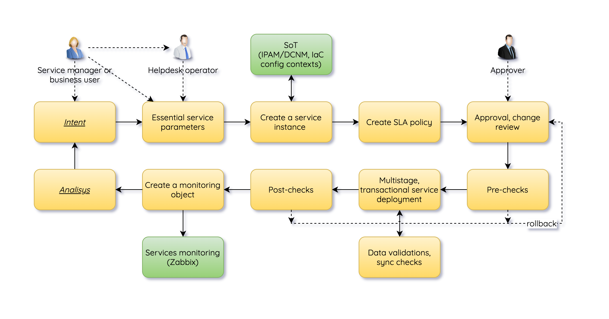
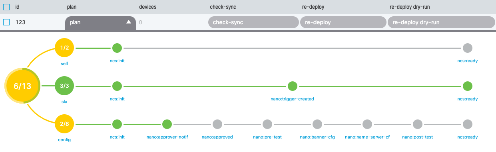
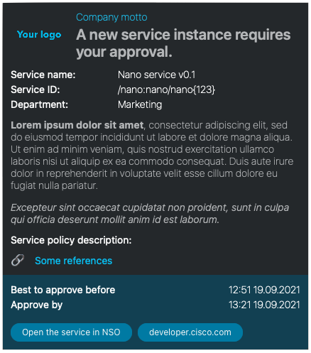
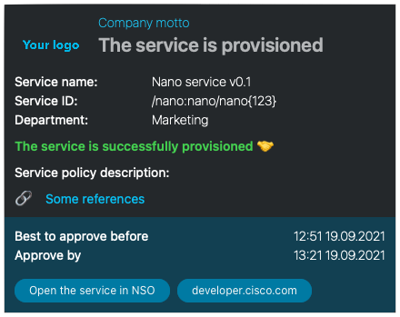
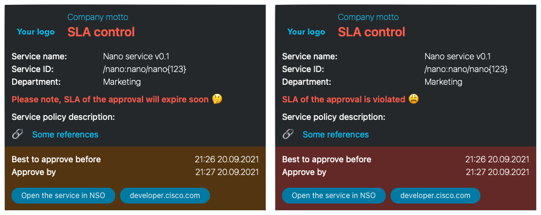

# An NSO Nano service as a CI/CD pipeline use case

> Please check [README.md](README.md) for how to run a supportive example.

NSO has many features to do configuration and service management in a very
reliable manner, including model-based network-wide transactions, rollbacks,
input data validation, etc. Service developers can extend this functionality
even further with the traditional CI/CD approach to add pipelines with testing
and deployment steps. A great example is
[Julio Gomez's work](https://github.com/juliogomez/netdevops), which is based on
NSO, Ansible, and GitLab CI/CD pipelines.

However, NSO has a great embedded toolset to implement full CI/CD pipelines with
the help of
[Nano services](https://developer.cisco.com/docs/nso/guides/#!nano-services).

## What are Nano services

Nano services are an evolution of Reactive FASTMAP and other design patterns
like subscribers and kickers. Nano services will allow you to describe a
high-level logic of the service and your pipeline with no or low code. You may
start with just YANG models and XML config templates. Oh, some XPath is still
there, but not too much. The main benefit of a Nano service is that you get a
bullet-proof framework to divide your complicated service into small states with
clear conditions to in and out between them. This design pattern allows you to
focus on your service logic instead of controlling the consistency of
configurations and rollbacks.

You may use Nano services in so many different ways. It could be a network or
device service provisioning divided into small parts, having separate diffs, and
executing in your defined order. For example, configure some QoS on one device
before enabling VoIP functions on another.

Moreover, Nano services shine when integration with other systems or NSO
services is desirable, especially when different parts of the service will be
ready at different times in an async manner. For example, request a VM creation
and stop executing a pipeline; continue when VM is ready.



This repo contains an example of an NSO service, named `nano`, to demonstrate
some possible features:

* define states of the service in YANG format, including conditions, and
  callbacks to start provision of parts of the service or call NSO actions
* use template-based device configuration with YANG and XML only, with adding
  Python for some parts if needed
* continue execution of next states automatically if pre-conditions are meet
  sometime; for example, post-tests finished with positive results
* pre and post-tests (NSO runs a command, pyATS parses the output)
* control of approvals of service with NETCONF Access Control Model (NACM)
* track and log execution progress of the states, including SLA tracking of
  created instances via Service Progress Monitoring policy of NSO
* modify, delete, rollback to a particular state, and re-apply the
  service
* Notify users via Webex bot

Network sophisticated configurations or core features of NSO aren't shown here
since they deserve separate showcases. I tried to keep this example runnable by
any user without excessive requirements to have a full-blown network sandbox and
access to the actual version of production NEDs. A demo version of NSO, a Linux
or macOS host, and Python is what you need.

Some ideas are worth considering to extend functionality further.

* full lifecycle management of monitoring objects in external monitoring systems
  based on configured network services
* management of resource allocations via external SoT systems, like IPAM and
  DCNM, or an internal native `NSO Resource Manager` package
* closed-loop automation with the help of middleware software to translate
  webhooks from the monitoring system to NSO NB interfaces to change parameters
  of the service
* extending testing functionality with frameworks like `pyATS`, `scrapli`,
  `pytest`
* separating a Webex notification action or testing actions to separate packages
  for easy consumption in other services

A word of caution. NSO is capable of doing a lot of things. Even so, there is
always a balance of doing it with internal tools or using an external
feature-rich and purpose-built toolset. In many cases splitting functionality
between NSO and other systems or frameworks may benefit your service
in better stability, functionality, maintainability, and faster development.

> Please note, that
> [CI/CD for developing of NSO services itself](https://developer.cisco.com/docs/network-automation-delivery-model/#!cicd)
> is not covered in this use case.

## Usage

### Init the service

A Service Progress Monitoring policy should be created to be used by `nano`
service instances. In real-life deployment, it's a one-time command, so it is
implemented as a manual process.

To init a Service Progress Monitoring policy, run `make cli`. A default password
for the user `admin` is `admin`.

```text
User admin last logged in 2021-09-18T15:29:01.25052+00:00, to localhost, from 127.0.0.1 using cli-console
admin connected from 127.0.0.1 using console on localhost
admin@ncs# nano sla init-sla-policy
SPM policy will be created or updated with SLA timeouts, are you sure? [yes,no] yes
result true
msg OK
admin@ncs#
System message at 2021-09-18 18:30:48...
Commit performed by admin via tcp using nano_helper.spm.
admin@ncs# show running-config service-progress-monitoring
service-progress-monitoring policy nano-sla-policy
 violation-timeout 3600
 jeopardy-timeout  1800
 condition self-ready
  component-type self
   what       all
   plan-state ready
   status     reached
  !
 !
 action action-path /nano/sla/timeouts/timeout
 action always-call true
!
admin@ncs#
````

Optionally you may change SLA timeouts of this policy.

```text
admin@ncs# c
admin@ncs# config
Entering configuration mode terminal
admin@ncs(config)# nano sla timeouts ?
Possible completions:
  jeopardy    Jeopardy timeout, minutes
  timeout     Manually send SLA notifications
  violation   Violation timeout, minutes
admin@ncs(config)# nano sla timeouts jeopardy 1 violation 2
admin@ncs(config)# commit dry-run
cli {
    local-node {
        data  nano {
                  sla {
                      timeouts {
             +            jeopardy 1;
             +            violation 2;
                      }
                  }
              }
    }
}
admin@ncs(config)# commit
Commit complete.
admin@ncs(config)#
System message at 2021-09-18 18:33:54...
Commit performed by system via tcp using nano_helper.spm.
admin@ncs(config)# do show running-config service-progress-monitoring
service-progress-monitoring policy nano-sla-policy
 violation-timeout 120
 jeopardy-timeout  60
 condition self-ready
  component-type self
   what       all
   plan-state ready
   status     reached
  !
 !
 action action-path /nano/sla/timeouts/timeout
 action always-call true
!
admin@ncs(config)# exit
admin@ncs#
```

### Configure the service

Network Configuration Access Control Model or NACM rules don't enforce a local
connection; you need to log in through SSH. We will use a user `engineer` who
has full access to the system and the service except for the `approved` flag.
For this user, use password `engineer`.

```text
$ make cli-en
ssh engineer@0.0.0.0 -p 2024 -o PreferredAuthentications=password -o PasswordAuthentication=yes -o PubkeyAuthentication=no
engineer@0.0.0.0's password:

engineer connected from 127.0.0.1 using ssh on localhost
engineer@ncs# c
engineer@ncs# config
Entering configuration mode terminal
engineer@ncs(config)# nano nano 123\
>
engineer@ncs# c
engineer@ncs# config
Entering configuration mode terminal
engineer@ncs(config)# nano nano 123
Value for 'device' [r0,r1]: r0
engineer@ncs(config-nano-123)# ?
Possible completions:
  check-sync           Check if device config is according to the service
  commit-queue
  deep-check-sync      Check if device config is according to the service
  device               Attached device
  get-modifications    Get the data this service created
  log
  name-server          Name server
  notify               Service notifications
  plan
  re-deploy            Run/Dry-run the service logic again
  reactive-re-deploy   Reactive re-deploy of service logic
  tests                Run tests
  touch                Mark the service as changed
  un-deploy            Undo the effects of the service
  ---
  commit               Commit current set of changes
  describe             Display transparent command information
  exit                 Exit from current mode
  help                 Provide help information
  no                   Negate a command or set its defaults
  pwd                  Display current mode path
  rload                Load configuration from an ASCII file or from terminal, relative to current location
  top                  Exit to top level and optionally run command
engineer@ncs(config-nano-123)# commit dry-run
cli {
    local-node {
        data  service-progress-monitoring {
             +    trigger nano-spm-123 {
             +        policy nano-sla-policy;
             +        component self;
             +        target /nano/nano[id='123'];
             +    }
              }
              nano {
             +    nano 123 {
             +        device r0;
             +    }
              }
    }
}
engineer@ncs(config-nano-123)# commit
Commit complete.
engineer@ncs(config-nano-123)#
System message at 2021-09-19 12:21:06...
Commit performed by engineer via system using cli.
engineer@ncs(config-nano-123)# end
engineer@ncs# show running-config nano
nano nano 123
 device   r0
 no approved
!
nano sla webex room-id %ENV{WEBEX_ROOM_ID}
nano sla webex bot-token %ENV{WEBEX_BOT_TOKEN}
engineer@ncs# show nano
nano nano 123
 plan-location /nano/nano[id='123']
                      BACK                                                                 POST ACTION
TYPE          NAME    TRACK  GOAL  STATE            STATUS       WHEN                 ref  STATUS
-----------------------------------------------------------------------------------------------------------
self          self    false  -     init             reached      2021-09-19T09:21:03  -    -
                                   ready            not-reached  -                    -    -
sla-com-type  sla     false  -     init             reached      2021-09-19T09:21:03  -    -
                                   trigger-created  reached      2021-09-19T09:21:03  -    -
                                   ready            reached      2021-09-19T09:21:03  -    -
cfg-com-type  config  false  -     init             reached      2021-09-19T09:21:03  -    -
                                   approver-notif   reached      2021-09-19T09:21:03  -    create-reached
                                   approved         not-reached  -                    -    -
                                   pre-test         not-reached  -                    -    -
                                   banner-cfg       not-reached  -                    -    -
                                   name-server-cfg  not-reached  -                    -    -
                                   post-test        not-reached  -                    -    -
                                   ready            not-reached  -                    -    -

                                                                         JEOPARDY                       VIOLATION           SUCCESS
NAME          POLICY           START TIME           JEOPARDY TIME        RESULT    VIOLATION TIME       RESULT     STATUS   TIME
-------------------------------------------------------------------------------------------------------------------------------------
nano-spm-123  nano-sla-policy  2021-09-19T12:21:03  2021-09-19T12:51:03  -         2021-09-19T13:21:03  -          running  -

engineer@ncs#
```

The Nano service plan in WebUI:



Note that the user cannot add the `approved` flag to the service configuration
because of the statically defined NACM rules in the
[configs/nacm.xml](configs/nacm.xml) file.

The `sla` component is responsible for creating an SPM trigger to track the SLA
of our service instance.

Also, note that `config` component is stopped on `approver-notif` state. That
means, we need an another user to login and change configuration of the service
by adding `approved` flag.

### Approve the service

`approver` user got a notification.



Log in to NSO with the user `approver` and password `approved`. Pay attention,
that `approver` cannot change service's configuration; commands `device` and
`name-server` are not visible or accessible.

```text
$ make cli-app
ssh approver@0.0.0.0 -p 2024 -o PreferredAuthentications=password -o PasswordAuthentication=yes -o PubkeyAuthentication=no
approver@0.0.0.0's password:

approver connected from 127.0.0.1 using ssh on localhost
approver@ncs# c
approver@ncs# config
Entering configuration mode terminal
approver@ncs(config)# nano nano 123
approver@ncs(config-nano-123)# dev?
                               ^
% Invalid input detected at '^' marker.
approver@ncs(config-nano-123)# ?
Possible completions:
  approved             Approved flag
  check-sync           Check if device config is according to the service
  commit-queue
  deep-check-sync      Check if device config is according to the service
  get-modifications    Get the data this service created
  log
  notify               Service notifications
  plan
  re-deploy            Run/Dry-run the service logic again
  reactive-re-deploy   Reactive re-deploy of service logic
  tests                Run tests
  touch                Mark the service as changed
  un-deploy            Undo the effects of the service
  ---
  commit               Commit current set of changes
  describe             Display transparent command information
  exit                 Exit from current mode
  help                 Provide help information
  no                   Negate a command or set its defaults
  pwd                  Display current mode path
  rload                Load configuration from an ASCII file or from terminal, relative to current location
  top                  Exit to top level and optionally run command
approver@ncs(config-nano-123)# approved
approver@ncs(config-nano-123)# commit dry-run
cli {
    local-node {
        data  nano {
                  nano 123 {
             +        approved true;
                  }
              }
    }
}
approver@ncs(config-nano-123)# commit
Commit complete.
approver@ncs(config-nano-123)#
System message at 2021-09-19 12:26:51...
Commit performed by approver via ssh using cli.
approver@ncs(config-nano-123)#
System message at 2021-09-19 12:26:52...
Commit performed by approver via system using cli.
approver@ncs(config-nano-123)#
System message at 2021-09-19 12:26:52...
Commit performed by approver via system using cli.
approver@ncs(config-nano-123)#
System message at 2021-09-19 12:26:53...
Commit performed by approver via system using cli.
approver@ncs(config-nano-123)#
System message at 2021-09-19 12:26:53...
Commit performed by approver via system using cli.
approver@ncs(config-nano-123)#
System message at 2021-09-19 12:26:53...
Commit performed by approver via system using cli.
approver@ncs(config-nano-123)# end
approver@ncs#
approver@ncs# show running-config nano
nano nano 123
 device   r0
 approved
!
nano sla webex room-id %ENV{WEBEX_ROOM_ID}
nano sla webex bot-token %ENV{WEBEX_BOT_TOKEN}
approver@ncs(config)# exit
approver@ncs#
```

Once the `approved` flag is committed, a series of commits will finish all
subsequent steps, including pre-test, change a banner and a name server,
post-test. As a part of SPM policy, a notification will be send.



In case of missed SLA, separate notifications will be sent by SPM policy
trigger.



### The plan

Check the executed plan of our service instance and generated and delivered
device configuration in NSO native format.

```text
approver@ncs# show nano
nano nano 123
 modified devices [ r0 ]
 directly-modified devices [ r0 ]
 device-list   [ r0 ]
 plan-location /nano/nano[id='123']
                      BACK                                                             POST ACTION
TYPE          NAME    TRACK  GOAL  STATE            STATUS   WHEN                 ref  STATUS
-------------------------------------------------------------------------------------------------------
self          self    false  -     init             reached  2021-09-19T09:21:03  -    -
                                   ready            reached  2021-09-19T09:26:53  -    -
sla-com-type  sla     false  -     init             reached  2021-09-19T09:21:03  -    -
                                   trigger-created  reached  2021-09-19T09:21:03  -    -
                                   ready            reached  2021-09-19T09:21:03  -    -
cfg-com-type  config  false  -     init             reached  2021-09-19T09:21:03  -    -
                                   approver-notif   reached  2021-09-19T09:21:03  -    create-reached
                                   approved         reached  2021-09-19T09:26:51  -    -
                                   pre-test         reached  2021-09-19T09:26:51  -    create-reached
                                   banner-cfg       reached  2021-09-19T09:26:51  -    -
                                   name-server-cfg  reached  2021-09-19T09:26:52  -    -
                                   post-test        reached  2021-09-19T09:26:53  -    create-reached
                                   ready            reached  2021-09-19T09:26:53  -    -

                                                                         JEOPARDY                       VIOLATION
NAME          POLICY           START TIME           JEOPARDY TIME        RESULT    VIOLATION TIME       RESULT     STATUS      SUCCESS TIME
----------------------------------------------------------------------------------------------------------------------------------------------------
nano-spm-123  nano-sla-policy  2021-09-19T12:21:03  2021-09-19T12:51:03  passed    2021-09-19T13:21:03  passed     successful  2021-09-19T12:26:53

approver@ncs(config)# nano nano 123 get-modifications
cli {
    local-node {
        data  devices {
                   device r0 {
                       config {
                           ip {
                               domain {
              +                    list example.com {
              +                    }
                                   lookup-conf {
              +                        lookup true;
                                   }
              +                    name example.com;
                               }
                               name-server {
              +                    name-server-list 208.67.222.222 {
              +                    }
                               }
                           }
                           banner {
              +                motd "The message of the day";
                           }
                       }
                   }
               }
               service-progress-monitoring {
              +    trigger nano-spm-123 {
              +        policy nano-sla-policy;
              +        component self;
              +        target /nano/nano[id='123'];
              +    }
               }

    }
}
approver@ncs(config)# exit
approver@ncs#
```

### Delete the service

To entirely delete the service instance, you need to remove the SLA policy firstly.

```text
admin@ncs(config)# end
admin@ncs# c
admin@ncs# config
Entering configuration mode terminal
admin@ncs(config)# nano nano 123
admin@ncs(config-nano-123)# plan ?
Possible completions:
  component   A component has a type and a list of states.
admin@ncs(config-nano-123)# plan component ?
Possible completions:
  cfg-com-type  self  sla-com-type
admin@ncs(config-nano-123)# plan component sla-com-type sla ?
Possible completions:
  force-back-track   Force a component to back-track
  state              A plan state represents a certain step or stage that a service needs to execute and/or reach.
admin@ncs(config-nano-123)# plan component sla-com-type sla force-back-track
result true
admin@ncs(config-nano-123)# no nano nano 123
admin@ncs(config)# commit dry-run
cli {
    local-node {
        data  devices {
                  device r0 {
                      config {
                          ip {
                              domain {
             -                    list example.com {
             -                    }
                                  lookup-conf {
             -                        lookup true;
                                  }
             -                    name example.com;
                              }
                              name-server {
             -                    name-server-list 208.67.222.222 {
             -                    }
                              }
                          }
                          banner {
             -                motd "The message of the day";
                          }
                      }
                  }
              }
              nano {
             -    nano 123 {
             -        device r0;
             -        approved true;
             -    }
              }
    }
}
admin@ncs(config)# commit
Commit complete.
admin@ncs(config)#
System message at 2021-09-19 12:41:20...
Commit performed by admin via system using cli.
admin@ncs(config)#
System message at 2021-09-19 12:41:20...
Commit performed by admin via system using cli.
admin@ncs(config)#
System message at 2021-09-19 12:41:20...
Commit performed by admin via system using cli.
admin@ncs(config)#
System message at 2021-09-19 12:41:20...
Commit performed by admin via system using cli.
admin@ncs(config)#
```

You may experiment a bit, revoke your approval, and see how NSO will back-track
all the changes that cannot exist without the `approve` flag.

## Related Sandbox

* [NSO sandbox for Self Learning](https://devnetsandbox.cisco.com/RM/Diagram/Index/43964e62-a13c-4929-bde7-a2f68ad6b27c?diagramType=Topology)

## Links to DevNet Learning Labs

NSO learning labs are a great way to explore capabilities and NSO and start
learning:

* [NSO Basics for Network Automation](https://developer.cisco.com/learning/modules/nso-basics)
* [NSO Intermediate and Advanced Topics](https://developer.cisco.com/learning/modules/nso)

Another option is to install NSO in Local Install mode and learn in your own
pace. For references check [README.md](README.md#Install-NSO).
